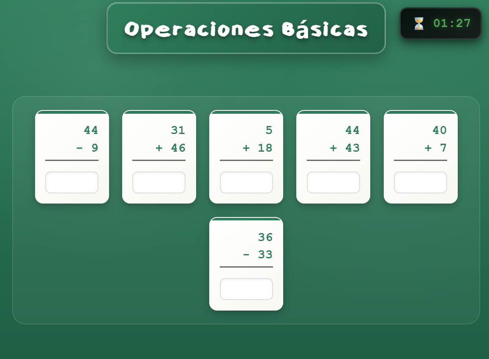

¡Excelente! Con la estructura actual y las nuevas características, el README necesita una renovación completa. Aquí tienes una versión actualizada y profesional que refleja el estado real del proyecto.

---

# 🧸 Juegos Infantiles — Web & App Android

**Repositorio:** `app-juegos-infantiles`  
**Autor:** Pau Gracia




---

## 📖 Descripción

**Juegos Infantiles** es una colección de **minijuegos educativos** desarrollada con **HTML, CSS y JavaScript puro**, pensada para que niños y niñas aprendan de forma **lúdica e interactiva**:

- 🧮 Matemáticas
- 🔤 Vocabulario y ortografía
- 🧠 Memoria visual
- ♟️ Pensamiento lógico y estrategia

El proyecto comenzó como una web y ha evolucionado hasta convertirse en una **aplicación Android completamente funcional**, manteniendo una **única base de código** gracias a **Capacitor**.

✅ **Totalmente operativa en:**  
📱 Android (app nativa) · 🖥️ Escritorio · 📟 Tablet

---

## 🎮 Juegos incluidos

| Juego | Descripción |
|-------|-------------|
| 🧠 **Enparejar** | Juego de memoria visual con ranking de puntuaciones y efectos visuales y sonoros. |
| ➕ **Operaciones Básicas** | Práctica de operaciones matemáticas con distintos niveles de dificultad. |
| 🔤 **Como se LLama** | Aprendizaje de vocabulario mediante casillas de letras. |
| 🎯 **Juego del Ahorcado** | Clásico juego del ahorcado multidioma para reforzar vocabulario. |
| ♟️ **Juego de Damas** | Juego completo de damas contra la IA con capturas obligatorias y coronación. |

> ℹ️ Los juegos de **Como se LLama** y **Juego del Ahorcado** permiten seleccionar el idioma de juego entre varios disponibles.

---

## 🌍 Internacionalización

La interfaz completa de la app está traducida a **8 idiomas**:

| Idioma | Código |
|--------|--------|
| Español | `es` |
| Inglés | `en` |
| Catalán | `ca` |
| Gallego | `gl` |
| Euskera | `eu` |
| Francés | `fr` |
| Italiano | `it` |
| Portugués | `pt` |

🌐 **Funcionamiento:**  
La app detecta automáticamente el idioma del dispositivo y carga la traducción correspondiente. Si no está disponible, el idioma por defecto es **inglés**.

En juegos como **Como se llama** y **Juego del Ahorcado**, el usuario puede elegir el idioma de juego independientemente del idioma de la interfaz.

---

## ✨ Características principales

- 🎮 **Menú central** con acceso rápido a todos los juegos
- 🎚️ **Configuración por juego** (niveles, dificultad, idioma)
- 🔊 **Efectos sonoros** para acciones y respuestas
- 🖼️ **Iconografía** intuitiva y amigable
- ✅ Feedback visual inmediato (acierto / error)
- 🏆 **Rankings locales** para Memori y otros juegos
- 📊 **Sistema de niveles** según el juego
- 📱 **Diseño responsive** optimizado para móvil y tablet
- 🖱️ **Compatible con escritorio** (funciona a la perfección)
- 🔒 **Orientación vertical (*portrait*)** en dispositivos móviles

---

## 🛠️ Tecnologías

### Frontend (base común)
- **HTML5** semántico
- **CSS3** (Flexbox, Grid, media queries)
- **JavaScript (Vanilla JS)** sin dependencias externas

### Internacionalización
- Sistema propio de carga dinámica de idiomas (`assets/i18n/*.js`)

### Almacenamiento
- **`localStorage`** para rankings, configuraciones y progreso

### Android (app nativa)
- **Capacitor** para empaquetado WebView
- **Android Studio** — versión desarrollada y testeada

### Herramientas
- **Git** (rama `main` estable)
- Servidor local opcional (ya no requiere PHP)

---

## 📂 Estructura del proyecto

```text
app-juegos-infantiles/
│
├── index.html                    # Menú principal
├── README.md
│
├── juegos/                       # Cada juego es independiente
│   ├── memori/
│   │   ├── index.html
│   │   ├── memori.css
│   │   ├── memori.js
│   │   └── sounds/               # Efectos sonoros del juego
│   ├── operaciones/
│   ├── palabras/
│   ├── juegoAhorcado/
│   ├── damas/
│   ├── ranking/                  # Ranking global
│   └── rankingMemori/            # Ranking específico de Memori
│
├── assets/
│   ├── css/
│   │   ├── app.css               # Estilos comunes
│   │   
│   ├── js/
│   │   ├── elementos.js          # Utilidades DOM
│   │   ├── i18n.js               # Motor de internacionalización
│   │   ├── juegos.js             # Lógica común a todos los juegos
│   │   └── palabras.js           # Utilidades para juegos de palabras
│   ├── i18n/                     # Traducciones por idioma
│   │   ├── es.js, en.js, ca.js, gl.js, eu.js, fr.js, it.js, pt.js
│   ├── img/
│   │   ├── iconos/               # Iconos de juegos y UI
│   │   └── imagenes/             # Capturas e ilustraciones
│   └── fonts/
```

---

## 🚀 Instalación y uso

### Modo web local

```bash
git clone https://github.com/PauGracia/app-juegos-infantiles.git
cd app-juegos-infantiles
```

Abre `index.html` en tu navegador favorito.  
⚠️ No necesita servidor PHP — todo funciona con HTML/CSS/JS puro.

### App Android (ya compilada)

El proyecto tiene una **versión funcional en Android Studio**, completamente testeada.  
Para generar la APK:

1. Abrir el proyecto con **Capacitor** o importarlo en Android Studio
2. Sincronizar Gradle
3. Ejecutar `Build > Build Bundle(s) / APK(s) > Build APK`

---

## 🌍 Demo online

👉 https://paugracia.github.io/app-juegos-infantiles/index.html

*Funciona en cualquier navegador moderno.*

---

## 🧪 Estado del proyecto

| Área | Estado |
|------|--------|
| Web (HTML/CSS/JS) | ✅ Completamente funcional |
| Internacionalización | ✅ 8 idiomas implementados |
| Rankings y niveles | ✅ Implementados |
| Efectos sonoros | ✅ Incluidos |
| Adaptación Android | ✅ Desarrollada y testeada |
| Orientación portrait | ✅ Forzada en móvil |
| Soporte tablet | ✅ Optimizado |

---

## 🔀 Flujo de desarrollo

El proyecto se mantiene en **una única rama `main`** estable.  
Todos los cambios se realizan sobre código ya adaptado a la arquitectura actual.

No se utiliza PHP ni backend externo.  
No se requieren dependencias complejas.

---

## 📜 Licencia

Proyecto personal con fines **educativos**, de **aprendizaje** y **portfolio**.

---

## 🙌 Agradecimientos

Este proyecto ha sido posible gracias al esfuerzo por mantener un código limpio, accesible y multidispositivo, pensando siempre en la experiencia infantil. 🧒✨